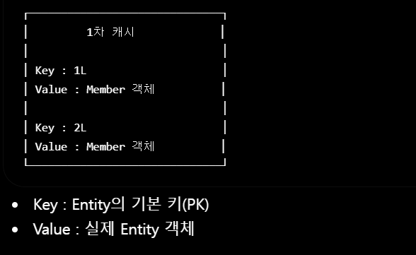

# JPA 생명주기

# 1. Entity 생명주기란?
JPA 에서 Entity는 생성될때 부터 삭제될 때 까지 여러 과정을 거친다. 이를 Entity의 생명주기라고 한다.

JPA는 Entity의 생명주기에 따라 데이터를 관리하고, 데이터베이스에 반영할지 여부를 결정한다.

### Entity의 생명주기 4가지
비영속(New, Transient)
        │
persist()
        ▼
영속(Managed)
   │      │
detach()  remove()
   ▼         ▼
준영속(Detached)   삭제(Removed)

# 2. 비영속
비영속 상태는 객체를 생성했지만 아직 JPA가 관리하지 않는 상태를 의미한다.

즉 메모리에만 존재하는 일반적인 JAVA 객체에 해당한다.

Member member = new Member();  
member.setName("김성찬");

메모리 : O

영속성 컨텍스트 : X

데이터베이스 : X

이 객체는 단순히 생성만 되었을 뿐이며, JPA와는 아무관련이 없다.

### 특징
* EntityManager가 관리하지 않는다.
* 영속성 컨텍스트에 존재하지 않는다.
* 데이터베이스와 연결되어 있지 않다.
* 변경해도 SQL이 실행되지 않는다.

# 3. 영속
영속 상태는 Entity가 영속성 컨텍스트에 저장되어 JPA가 관리하는 상태를 말한다.

Member member = new Member(); 
member.setName("김성찬");

entityManager.persist(member);

persist()를 호출하면 Entity가 영속성 컨텍스트에 등록된다.

메모리 : O

영속성 컨텍스트 : O

데이터베이스 : 아직 저장되지 않을 수도 있음

## 특징
* JPA가 Entity를 관리한다.
* 변경 감지(Dirty Checking)가 가능하다.
* 1차 캐시에 저장된다.
* 동일성이 보장된다.
* 쓰기 지연 저장소에 SQL이 저장된다.
* flush() 또는 commit() 시점에 데이터베이스와 동기화된다.

# 4. 준영속
준영속 상태는 영속성 컨텍스트가 Entity를 더이상 관리하지 않는 상태이다.

Entity객체에는 존재 하지만 더 이상 JPA가 관여하지 않는 상태이다.

Member member = entityManager.find(Member.class, 1L); 
entityManager.detach(member);

메모리 : O

영속성 컨텍스트 : X

데이터베이스 : O

### 특징
* 객체는 메모리에 존재한다.
* JPA가 관리하지 않는다.
* 변경 감지가 동작하지 않는다.
* 값을 수정해도 UPDATE SQL이 생성되지 않는다.

# 5. 삭제
삭제 상태는 Entity가 삭제 대상으로 등록된 상태이다.

Member member = entityManager.find(Member.class, 1L); 
entityManager.remove(member);

메모리 : 삭제 예정

영속성 컨텍스트 : 삭제 상태

데이터베이스 : commit() 전까지 존재

### 특징
* 삭제 대상으로 관리된다.
* commit() 시 DELETE SQL이 실행된다.
* 트랜잭션이 종료되면 데이터베이스에서 삭제된다.

# 6. 상태변화 과정
### 비영속 -> 영속

Member member = new Member(); 
entityManager.persist(member);

비영속 -> persist() -> 영속

### 영속 -> 준영속

entityManager.detach(member);

영속 -> detach() -> 준영속

### 영속 -> 삭제

entityManager.remove(member);

영속 -> remove() -> 삭제

### 준영속 -> 영속

준영속 -> merge() -> 영속

# 7. 생명주기 정리

# 8. 왜 Entity 생명주기가 중요할까?
JPA의 핵심 기능인

* 변경 감지(Dirty Checking)
* 1차 캐시
* 동일성 보장
* 쓰기 지연
이것들은 모두 영속상태의 Entity에서만 작동된다.